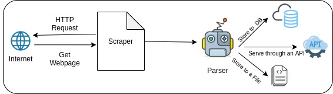

# :spider: Scraping 101 in Python :snake:

[Watch this Talk on Youtube](https://www.youtube.com/watch?v=QGOjLK4TRKw)

## Web scraping 

> _Web scraping, web harvesting, or web data extraction is data scraping used for extracting data from websites. Web scraping software may access the World Wide Web directly using the Hypertext Transfer Protocol, or through a web browser. While web scraping can be done manually by a software user, the term typically refers to automated processes implemented using a bot or web crawler. It is a form of copying, in which specific data is gathered and copied from the web, typically into a central local database or spreadsheet, for later retrieval or analysis._
            - Wikipedia

                                                or 

A technique to extract(with the permission of authors/publishers ofcourse) information that you see on the webpages as you browse.

## :thinking: Why ?

- To extract information
- A website may or may not have an API!
- Even if it does, you might be rate limited.

## :confused: What can I do?
- Extract coupon information from deal of the day websites.
- Scrape reviews of your favourite films
- Capture data from Government websites and create datasets.
- Extract articles from news websites and make a news aggregator.

### :smile: More Ideas
- [Webscraping Ideas](https://www.parsehub.com/blog/web-scraping-ideas/)
- [Webscraping Project Ideas - Medium](https://medium.com/scraperhq/web-scraping-project-ideas-50de5d21947)
- [10 Mobile App Ideas that can be fueled by webscraping](https://www.promptcloud.com/blog/mobile-app-ideas-fueled-by-web-scraping/)

## :angry: But How?

### :bank: Available Libraries

#### :satellite: For making HTTP Requests
- [requests](https://requests.readthedocs.io/en/master/)
- [urllib](https://docs.python.org/3/library/urllib.html)

#### :gear: For Parsing webpages
- [Beautiful Soup 4](https://www.crummy.com/software/BeautifulSoup/)
- [Lxml](https://lxml.de/)
- re

#### :bug: For writing spiders/crawlers
- [Scrapy](https://scrapy.org/)
> Extra credit: Selenium

## :books: Resources
- [Webscraping by Wikipedia](https://en.wikipedia.org/wiki/Web_scraping)
- [Khalid's Talk on Webscraping in EuroPython](https://www.youtube.com/watch?v=TeXRh17pB6c)
- [Real Python Series on Webscraping](https://realpython.com/tutorials/web-scraping/)
  

## :package: Projects to checkout
  :bell: [Conference Notify](https://github.com/rajatkb/Conference-Notify)

:rotating_light: [Covid 19](https://github.com/anandology/covid19)

:rocket: [ISRO News](https://github.com/sakethramanujam/isronews)
